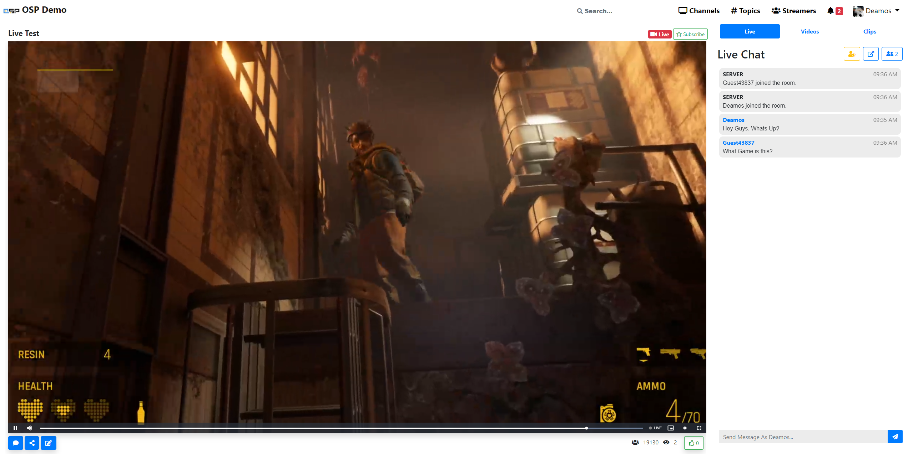

<!--
N.B.: This README was automatically generated by https://github.com/YunoHost/apps/tree/master/tools/README-generator
It shall NOT be edited by hand.
-->

# Open Streaming Platform for YunoHost

[](https://dash.yunohost.org/appci/app/osp)  

[](https://install-app.yunohost.org/?app=osp)

*[Lire ce readme en français.](./README_fr.md)*

> *This package allows you to install Open Streaming Platform quickly and simply on a YunoHost server.
If you don't have YunoHost, please consult [the guide](https://yunohost.org/#/install) to learn how to install it.*

## Overview

Open Streaming Platform (OSP) is an open-source, RTMP streamer software front-end for Arut's NGINX RTMP Module.
OSP was designed a self-hosted alternative to services like Twitch.tv, Ustream.tv, and Youtube Live.

**Shipped version:** 0.9.10~ynh1

**Demo:** https://demo.openstreamingplatform.com/

## Screenshots



## Documentation and resources

* Official app website: <https://openstreamingplatform.com/>
* Official user documentation: <https://yunohost.org/apps>
* Official admin documentation: <https://wiki.openstreamingplatform.com>
* Upstream app code repository: <https://gitlab.com/Deamos/flask-nginx-rtmp-manager>
* YunoHost Store: <https://apps.yunohost.org/app/osp>
* Report a bug: <https://github.com/YunoHost-Apps/osp_ynh/issues>

## Developer info

Please send your pull request to the [testing branch](https://github.com/YunoHost-Apps/osp_ynh/tree/testing).

To try the testing branch, please proceed like that.

``` bash
sudo yunohost app install https://github.com/YunoHost-Apps/osp_ynh/tree/testing --debug
or
sudo yunohost app upgrade osp -u https://github.com/YunoHost-Apps/osp_ynh/tree/testing --debug
```

**More info regarding app packaging:** <https://yunohost.org/packaging_apps>
